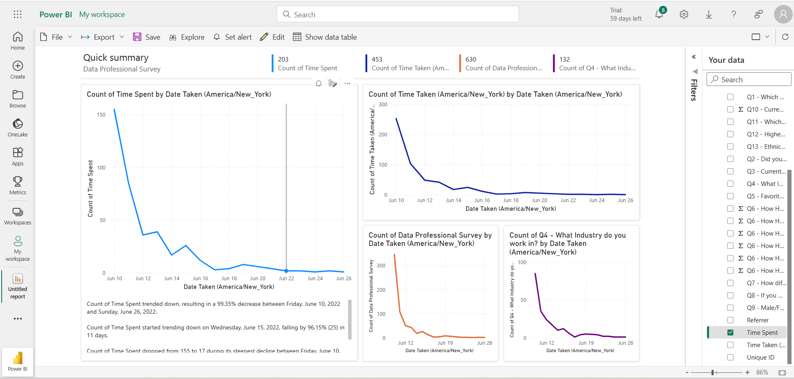

This Power BI report was automatically created on the Power BI Service (Software as a service: Saas). It provides an interactive analysis of survey responses collected from data professionals, focusing on time spent, participation trends, and industry distribution over time.

🟢 Project Overview
The dashboard enables stakeholders to:

Visualize survey participation trends over time.

Track engagement metrics by date.

Understand response distributions for specific survey questions.

⚙️ Data Source
Dataset: Data Professional Survey

Time Zone: America/New_York

Date Range: June 10–June 26, 2022

📈 Key Visualizations
Count of Time Spent by Date Taken

Description: Line chart showing the daily count of time spent completing the survey.

Insight: A dramatic decline in participation (~99% decrease) after June 10.

Count of Time Taken by Date Taken

Description: Line chart visualizing the volume of recorded time entries each day.

Insight: Confirms a sharp drop-off in survey engagement.

Count of Data Professional Surveys by Date Taken

Description: Line chart displaying the number of completed surveys per day.

Insight: Participation dropped significantly after June 12.

Count of Q4 – What Industry Do You Work In? by Date Taken

Description: Line chart measuring industry question responses over time.

Insight: Mirrors the overall decline in survey submissions.

📊 Key Metrics Summary
Count of Time Spent: 203

Count of Time Taken: 453

Count of Surveys: 630

Count of Industry Question Responses: 132

🧠 Narrative Insights
Below the charts, autogenerated insights explain:

Percentage decreases in participation.

The steepest decline period.

Day-by-day trend commentary.

🧰 Features
Interactive filters by survey questions and metrics.

Time series visualizations to monitor response trends.

Clean, minimalist layout optimized for quick summaries.

Export and sharing options via Power BI Service.

🚀 Usage
This report helps:

Survey administrators track engagement patterns.

Data teams identify dates with low participation.

Stakeholders gain a clear, visual summary of response behavior.
